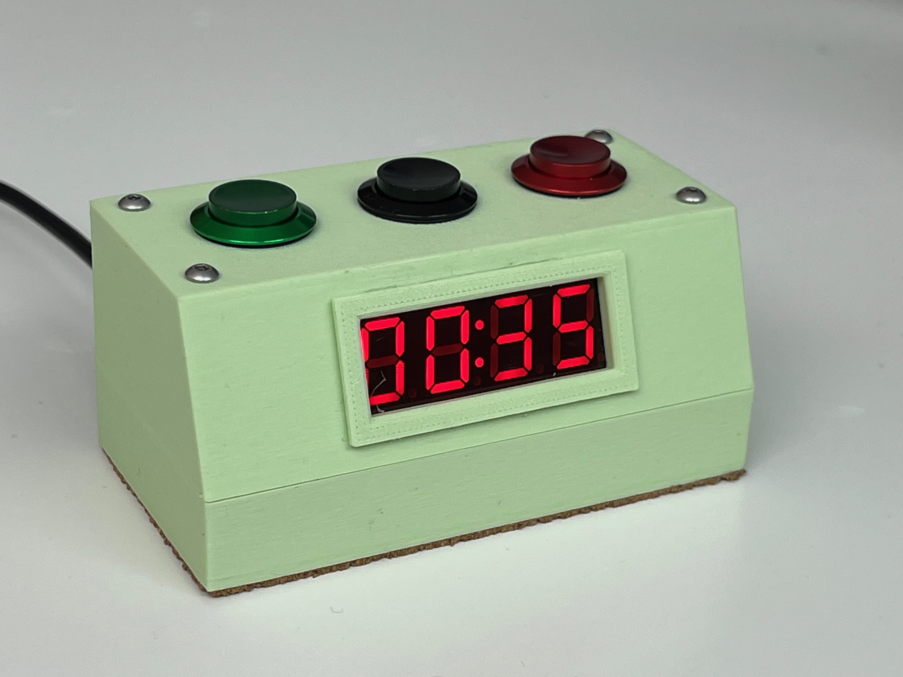

# Darkroom Timer

A simple, USB-powered stopwatch-style timer designed for darkroom print development. This project uses an Arduino Nano, TM1637 LED display, and tactile buttons to provide a clean interface with optional audible ticking. The case is custom-designed in FreeCAD and 3D printed.

---

## Features

- Large, easy-to-read 4-digit red LED display
- Start, Stop, and Reset buttons
- Optional ticking sound for each second
- Long-press reset to power off the unit
- USB-C power support with adapter separation from programming port
- Simple display bezel and safelight-compatible red gel filter

---

## Build Overview

### Enclosure Assembly
- The case includes internal bosses designed to match the size and shape of each board.
- Components are held in place with small beads of **hot glue**, enough to prevent rattling without requiring mechanical fasteners.
- The red gel filter is cut **after assembly** using scissors or a hobby knife to match the display opening.
- Once cut, the gel is placed on the display, and the stepped bezel is installed.
- The bezel is held in place using **thin beads of hot glue** at several points around the edge.
- Any squeeze-out from glue can be gently peeled or trimmed for a clean finish.

### Power
- The USB-C power adapter module provides regulated 5V to the circuit.
- This adapter is intentionally used **instead of the Arduino Nano's USB port**, so the device cannot be accidentally connected to a computer.
- This allows the timer to be safely powered by nearly any USB-C source, including laptop power bricks, phone chargers, or computer USB ports.

### Wiring
- All wiring is point-to-point using flexible stranded hookup wire.
- The TM1637 display module has two sets of 4 pads (CLK, DIO, GND, 5V). Either set may be used.
- A recommended wiring pattern:
  - **GND from display** connected in a daisy-chain to each of the three momentary switch grounds.
  - **5V and GND from power board** go to display and Arduino.
  - **CLK and DIO** from the display go to pins D2 and D3 on the Arduino.
  - The buttons connect to pins D4 (Start), D5 (Stop), and D6 (Reset).
  - The passive buzzer connects to D7.
- All inputs use `INPUT_PULLUP` mode in the Arduino code, so switches should connect to **GND when pressed**.

---

## Usage

- Press **Start** to begin the timer.
- Press **Stop** to pause the timer.
- Press **Reset** to zero the display.
- **Start + Reset** enables ticking (a short beep each second).
- **Stop + Reset** disables ticking.
- **Hold Reset** for a long press (0.5s) to power off the display.

---

## Files

- `Arduino/darkroom_timer/darkroom_timer.ino` — main Arduino sketch
- `3D/darkroom_timer.FCStd` — FreeCAD source file
- `3D/*.stl` — exported STL files for printing case and bezel

For the full parts list, see `parts_list.md`.

